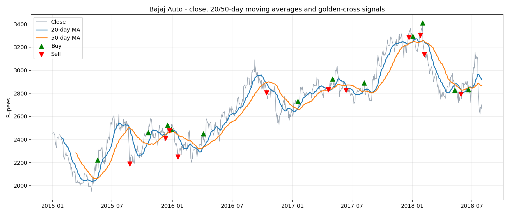
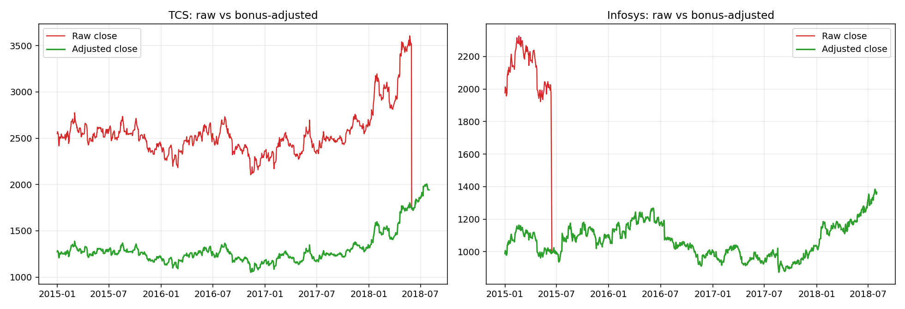

# Stock Market Analysis in SQL (6 NSE stocks, Jan 2015 - Jul 2018)

Complete, ready-to-run project: data cleaning, SQL for all 13 tasks (+ stretch task), results, charts, insights PDF.

## Quick start (VS Code)
```bash
pip install -r requirements.txt
python run_project.py          # clean -> load SQLite -> run SQL -> checkpoints -> charts
python make_insights_pdf.py    # rebuilds insights/Insights_Report.pdf
```
Python 3.9+ needed. No database install required (SQLite is built into Python).
Optional VS Code extension for browsing `stock_market.db`: "SQLite Viewer".

## Folder layout
| Path | What it is |
|---|---|
| `data/raw/` | original CSVs |
| `data/clean/` | cleaned CSVs (ISO dates, snake_case columns, sorted, NULLs kept) |
| `sql/sqlite/analysis_sqlite.sql` | all tasks 1-14, SQLite (this is what run_project.py executes) |
| `sql/mysql/01_create_and_load_mysql.sql` | MySQL: create DB + tables + load clean CSVs |
| `sql/mysql/02_analysis_mysql.sql` | MySQL 8 version of all tasks (incl. `CREATE FUNCTION bajaj_signal`) |
| `outputs/results/` | one CSV per task + data-quality report + checkpoint results |
| `outputs/charts/` | PNG charts |
| `insights/Insights_Report.pdf` | insights PDF (claim - evidence - caveat) |
| `stock_market.db` | generated SQLite database |

## For the MySQL submission
1. Edit the path in `01_create_and_load_mysql.sql` (`/FULL/PATH/TO/stock_market_sql`) and enable `local_infile`.
2. Run `01_...` then `02_...` in Workbench. Expected: 889 rows per table.
3. The MySQL files were converted from the tested SQLite version (YEAR(), backticked `signal`, DELIMITER function) but could not be executed on a MySQL server while building, so run them once and compare with `outputs/results/`.

## Key results (all 13 guide checkpoints pass)
- Raw % change: TVS +86.9, Eicher +82.6, Bajaj +10.0, Hero +6.0, TCS -23.8, Infosys -30.9
- Data trap: TCS 2018-05-31 and Infosys 2015-06-15 are 1:1 bonus issues (about -50% in one day)
- Adjusted % change: TCS +52.4, Infosys +38.2
- Signals (raw prices): Bajaj 12/11, Eicher 6/7, Hero 9/9, Infosys 9/9, TCS 12/13, TVS 8/8 = 56 Buys, 57 Sells

## Still to do yourself
Record the walkthrough video, and read the PDF once so you can explain it in your own words.

## MySQL run (verified)
`final_submission.sql` = `01_create_and_load_mysql.sql` + `02_analysis_mysql.sql`.
Tested on MySQL (Homebrew, port 3307) from a fresh database with zero errors.
Output is saved in `outputs/mysql/final_run_output.txt` and matches the SQLite results
(56 Buys / 57 Sells, TCS +52.4% and Infosys +38.2% after bonus adjustment).
Before running elsewhere, change the `LOAD DATA LOCAL INFILE` paths in the SQL file to your own folder.

## MySQL run (verified)
`final_submission.sql` = `01_create_and_load_mysql.sql` + `02_analysis_mysql.sql`.
Tested on MySQL (Homebrew, port 3307) from a fresh database with zero errors.
Output is saved in `outputs/mysql/final_run_output.txt` and matches the SQLite results
(56 Buys / 57 Sells, TCS +52.4% and Infosys +38.2% after bonus adjustment).
Before running elsewhere, change the `LOAD DATA LOCAL INFILE` paths in the SQL file to your own folder.

## Preview


